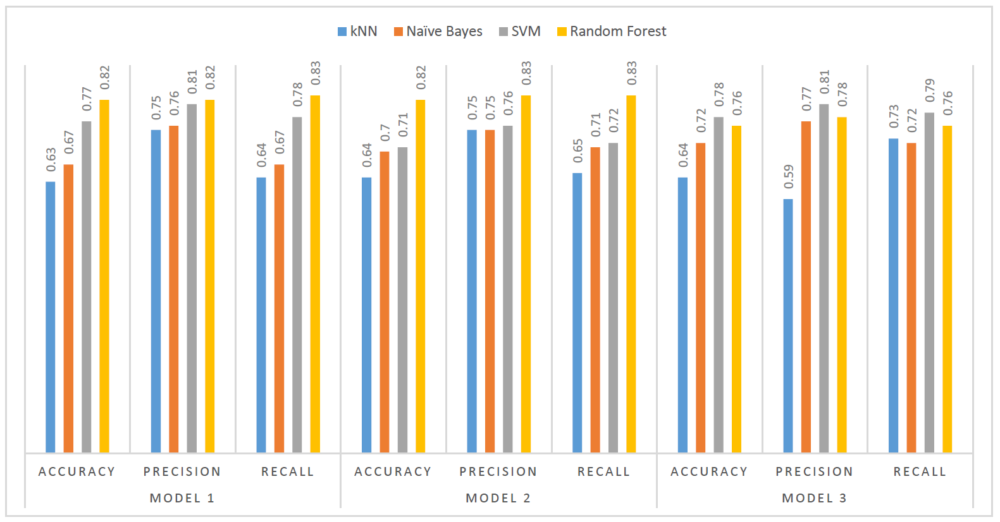

# Classification of HTML Documents - Comparison among Multiple Classifying Techniques

HTML document classification is a classic problem. Researchers have been working on this problem for a while. In this project, we are also working on the same problem of HTML document classification. We have used 4 universities dataset for analysis and experimentation. We have done all the pre-processing steps including html documents parsing, stopwords removal, lemmatization and unwanted terms removal. We have also performed the visualization to get some initial insights from our dataset. We have used 4 different classifiers including KNN, Naive Bayes, SVM and Random Forest and compared their performance to determine the best model for our dataset. We made use of different evaluation measures to evaluate the models. From our analysis we conclude that Random Forest is the best classifier among all we used for the HTML document classification. We achieved a maximum accuracy of around 84% using Random Forest.

## ML models used:

- K Nearest Neighbors
- Naive Bayes
- Support Vector Machine
- Random Forest

## Evaluation

The following barchart depicts the gist of the evaluation results of trained models:

## Source Code and Data

- [CODE](https://github.com/anik801/HtmlClassification/blob/master/main.py) is the source code for classification task.
- [DATASET](https://github.com/anik801/HtmlClassification/tree/master/webkb) contains the raw dateset used in this project.
- [OUTPUT](https://github.com/anik801/HtmlClassification/blob/master/Result.txt) contains the inital results.
- [REPORT](https://github.com/anik801/HtmlClassification/blob/master/Report.pdf) contains detailed project report.

## Project Team and Contributors

- [Sheik Murad Hassan Anik](https://www.linkedin.com/in/anik801/)
- Fahad Ibrar
